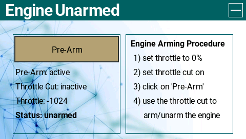
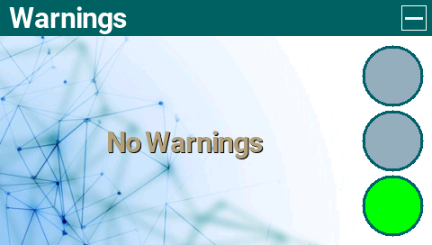

# EdgeTX-Goodies
Some widgets, themes and other scripts for EdgeTX

See the individual folders for details & instructions

Note: if a widget does not have a readme file that simply means this is a dedicated widget I made for myself for a dedicated purpose. Feel free to use them but don't expect it to work for you!

## GaugePRO
A configurable, responsive gauge widget with a custom label

## PiePRO
A configurable, responsive pie widget with a custom label

## SwitchPRO
A configurable, responsive widget that displays the status of a 3-way switch. The clou is that you can give a custom title per switch position

## ValuePRO
A configurable, responsive widget to display any value with a custom label

## PreArm
A widget to provide an extended throttle cut for better security

## Warnings
A widget that displays warnings and error together with a status indicator. 
Note: you'll propably need to adjust the script for your own warnings

## Horizon
Coming soon

## BattCheck
Note: this is not my widget, I've just extended it to use the EdgeTX theme colors

## Graph
Note: this is not my widget, I've just extended it to use the EdgeTX theme colors

## Grown Up Theme
A simple, clean and professional theme

